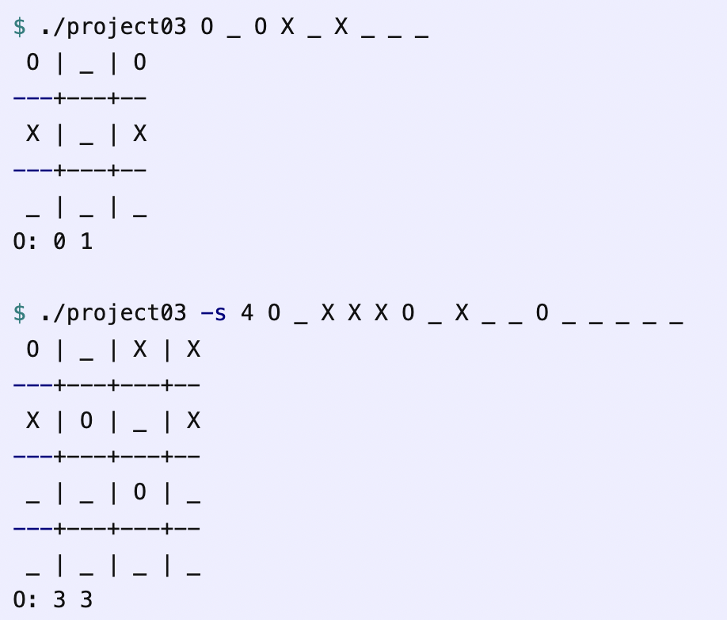

# TicTacToe-using-Minimax

## Overview
Minimax is a backtracking algorithm that is used in decision making and game theory to find the optimal move for a player, assuming that your opponent also plays optimally. It is widely used in two player turn-based games such as Tic-Tac-Toe, Backgammon, Mancala, Chess, etc. This program works with TicTacToe
The two players are called maximizer and minimizer. The maximizer tries to get the highest score possible while the minimizer tries to do the opposite and get the lowest score possible.

<p align="center">
  
</p>

## Methods
+ init_board: accept input from ```char* argv[]``` specifying Row and Column inputs to the Tic-Tac-Toe board. For instance, in a 3x3 board, 0 0 is the upper left and 2 2 is the lower right.
+ print_board: print the content of the board.
+ check_board: win and draw patterns on the board. return 1 if X wins, -1 if O wins, 0 if draw.

## Additional details and features
1. The default board size is 3. If ```argv[1]``` is equal to ```-s```, then ```argv[2]``` gives a new board size. For example, ```./project03 -s 4``` will play a full game on a 4x4 board.
2. If ```argc > 9``` the program will accept board values in ```argv[]```, and use Minimax to output the optimal next move for that board.
You may assume that it’s ‘O’s turn, and ‘X’ is the maximizer
If ```argc < 4``` the program will use a loop to play a full game, with a human playing ‘X’ and the computer using Minimax to play ‘O’.
‘X’ always goes first